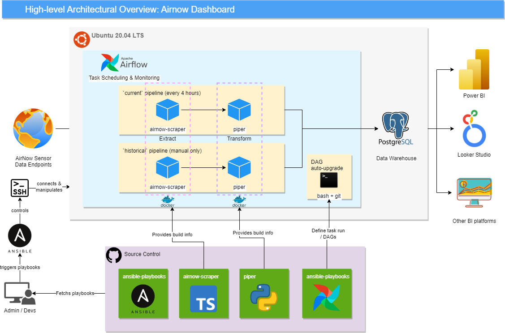

# Deployment

## What this repo is for

This repo outlines a general overview of the airnow-dashboard system, and the steps required to deploy the airnow-dashboard components.

## Architectural Overview

This system fetches, processes, then store data from AirNow DoS data sources.

The data will be updated recurrently at a specified period. (Default is 4 hours)

Then, any external BI tools with capabilities to connect to PostgreSQL can be used to fetch and display the data in near real time.

This system requires an **Ubuntu 20.04 LTS** server to be deployed. 

## System Components

- `airnow-scraper`: A simple TypeScript scraper to fetch JSON/CSV files from AirNow. Responsible for **Extract** part of the ETL pipeline.
- `piper`: A simple Python script to read, transform, and store data into PostgreSQL database. Responsible for **Transform** & **Load** part of the ETL pipeline.
- `Airflow`: An open-source workflow orchestration engine. Responsible for scheduling tasks aw well as reporting and monitoring their statuses.
- `PostgreSQL`: An popular open-source database that can serve both OLAP & OLTP purposes. Responsible for storing the AirNow data and provide external connection to BI tools to access.
- `Docker`: An open-core containerization tool. Responsible for building images and containers and provide container runtime for actually running the images.
- `Ansible`: An open-source IT automation tool. It relies on Python3 & SSH to connect to remote machines and perform tasks. Responsible for initializing and deploying components in a new environment.

## Deployment Prerequisites

- A machine running **Ubuntu 20.04 LTS**, which you:
  - are able to connect to the said machine using SSH
  - have root privileges (can run as root)
- Have **Python3.9+** installed on your local machine. This is for fulfilling the requirement for executing Ansible playbooks. 

## Deployment Steps

1. **Install Ansible.**
   - [Follow the instructions](https://docs.ansible.com/ansible/latest/installation_guide/intro_installation.html) to install Ansible in your OS.
2. **Download the Ansible playbook from [code repo](https://github.com/airnow-dashboard/ansible-playbooks).**
   - Use `git clone` or download via web browser to download the playbooks from the repo `ansible-playbook` here.
3. **Configure the playbook.**
   - There are several things to be configured before the playbook can be deployed. Namely:
     1. The remote host machine ip address i.e. `inventory.yaml`,
     2. The common variables i.e. `group_vars/all/vars.yaml`, and
     3. The secret variables i.e. `group_vars/all/vault`.
   - By default, `group_vars/vault` and `inventory.yaml` are not present in the repo as it contains sensitive information. You will need to create your own. For `inventory.yaml`, you need to follow the template i.e. `inventory.yaml.template` to create a new one. For `group_vars/all/vault`, You can run this command to create a new one: `ansible-vault create ./group_vars/all/vault`. Be sure to follow the format of the template i.e. `group_vars/all/vault.template`.
   - For creating/modifying/deleting Ansible vaults, please refer to [this Readme file](https://github.com/airnow-dashboard/ansible-playbooks#readme), as well as [the official documentations](https://docs.ansible.com/ansible/2.8/user_guide/vault.html).
4. **Deploy via Ansible.**
   - Run this command to deploy: `ansible-playbook -i inventory.yaml playbook.yaml --ask-vault-pass`. You will need to provide the vault's password for Ansible to read the content. Otherwise, the deployment will most likely fail due to the secrets are undefined.
5. **(Optional) Connect to the machine and access to Airflow's web console.**
   - After the deployment, you can connect to the machine to check if Airflow is running properly and all the DAGs are present.
   - For security reason, it is recommended to connect to the web console (located at port 8080) using SSH tunneling i.e. `ssh {username}@{remote-machine-ip} -L:8080:localhost:8080`, then use a web browser to visit http://localhost:8080.
   - If needed, [the DAG `airnow-fill-historical-data`](https://github.com/airnow-dashboard/airflow-dags/blob/master/airnow-fill-historical-data.py) can also be manually triggered in the web console. This will backfill all historical AirNow data into the PostgreSQL database.
